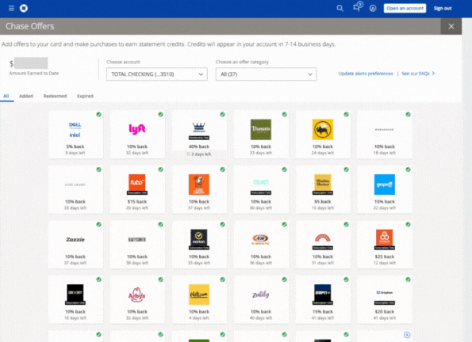

# Chase-Activate-All-Offers

<div align="center">
<table>
<tr>
<td>

</td>
</tr>
<tr>
<th>
See it in action
</th>
</tr>
</table>
</div>

## Description

Most offers on the Chase website are not useful but I forget them and then I miss out on the ones that are useful since they are hard to find and click on. This script will activate all offers on the Chase website. It is very painful to activate them all manually by hand. This script will save you time and money. 

19 lines of JS does the trick. It doesn't deserve its own repo but it was too good for just a Gist. 

## Usage

### Option 1: Dev Console
1. Open the Chase website and navigate to the "Chase Offers" page
2. Open the developer console in dev tools
3. Copy the contents of [main.js](./main.js) into the console and press enter
4. Wait for the script to finish, it can also run in the background so you can continue with your own work

### Option 2: JS Bookmarklet

1. Select the following and drag it into your bookmarks tab
```js
javascript:(function(){ var intervalId = setInterval(function() { var element = document.querySelector('._4jplu9 .horizontal-margin'); if (element) { element.click(); setTimeout(function() { window.history.back(); }, 1000); } else { clearInterval(intervalId); console.log('Element not found, stopped the interval.'); } }, 2000); })();
```
2. Open the chase offers page and hit the bookmark!
3. Wait for the script to finish, it can also run in the background so you can continue with your own work
